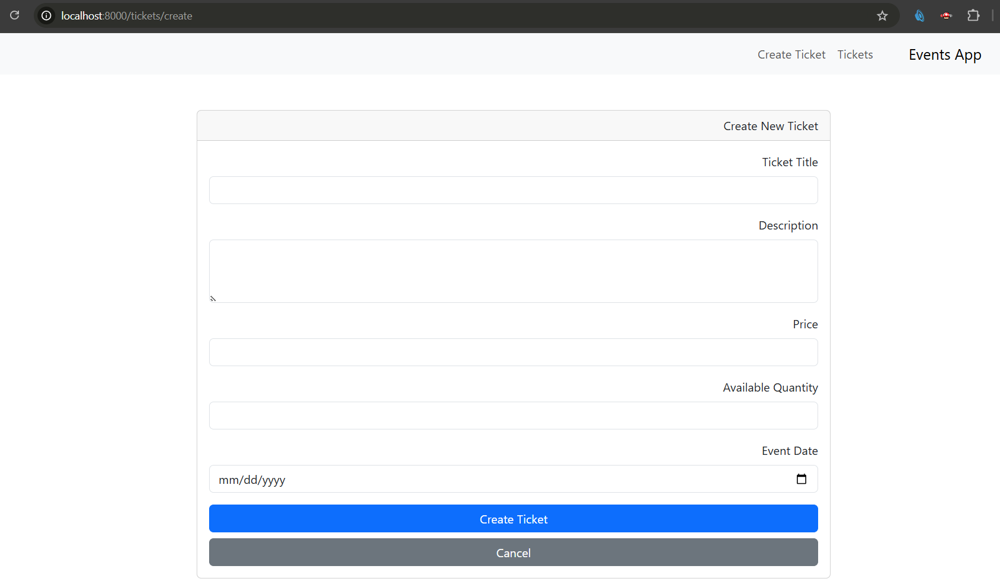
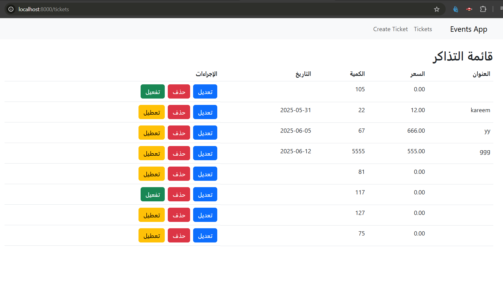

# 🎟️ Event Management System - Laravel

Welcome to the **Event Management System**, a Laravel-based project developed by **Jihad Abu Saleh**.  
This project is designed to manage events, users, and tickets via a modern API-driven backend.

---

## 📌 Project Description

This Laravel application includes:

- Event and ticket management functionalities.
- API authentication using Laravel Sanctum.
- Interactive API documentation using Swagger (L5 Swagger).
- Organized Laravel architecture (Controllers, Models, Migrations, etc).
- Modern development setup with Vite and Pest for testing.

---

## 🌐 GitHub Repository

Repository: [https://github.com/Web2SupabaseLaravel/930-grp6-repo.git](https://github.com/Web2SupabaseLaravel/930-grp6-repo.git)  
Branch: `jihad`

To clone the project:

```bash
git clone -b jihad https://github.com/Web2SupabaseLaravel/930-grp6-repo.git
cd 930-grp6-repo
```

---

## ⚙️ Requirements

- PHP >= 8.2
- Composer
- Node.js & NPM
- supabaes

---

## 🚀 Setup Instructions

1. **Install dependencies:**

```bash
composer install
npm install
```

2. **Set up the environment file:**

```bash
cp .env.example .env
php artisan key:generate
```

3. **Run migrations:**

```bash
php artisan migrate
```

4. **Serve the application:**

```bash
php artisan serve
```

5. **Run frontend assets (Vite):**

```bash
npm run dev
```

---

## 🧪 Running Tests

```bash
php artisan test
```

---

## 🛡️ API Documentation (Swagger)

Access the auto-generated Swagger documentation at:

```
http://localhost:8000/api/documentation
```

---

## 🖼️ Screenshots

> Add your screenshots related to ticket creation, listing, and booking here:

- 
- 

---

## 👤 Author

**Jihad Abu Saleh**  
Laravel Project — 2025

---

## 📄 License

This project is open-source and available under the [MIT license](LICENSE).


shoookraaan shooookraaaan
